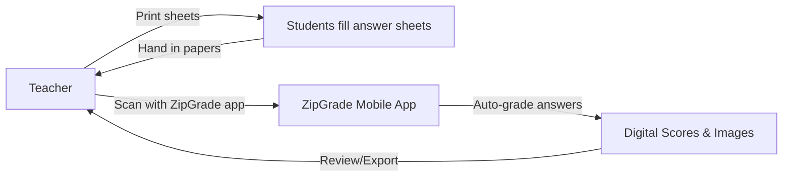

# Executive Summary  
**ZipGrade** is a mobile grading app (iOS/Android) that turns a smartphone/tablet into an optical scanner for paper quizzes.  Founded by John Viebach (ZipGrade LLC) to help teachers grade bubble sheets without expensive Scantron machines, it’s used by over 1 million teachers.  Teachers print answer forms (20, 50, or 100 questions) and use the ZipGrade app to create a quiz, define or scan the answer key, then scan students’ papers.  The app auto-grades and immediately shows scores; detailed reports and item analysis are available on the app or companion website.  A free tier allows **100 papers/month**, and unlimited grading is available via an annual subscription (~$6–7/yr).  ZipGrade supports multiple-choice, true/false, matching, and gridded numeric questions (plus creative “rubric” grading for essays via alternate answers).  It works offline (no Wi-Fi needed to scan), with data optionally syncing to ZipGrade’s cloud for extra reports and remote student quizzes.  Privacy is teacher-controlled: student names/IDs are used only if entered by the teacher, all data can be edited/deleted by the teacher, and student portal submissions require teacher-issued codes.  In practice, users report ZipGrade is **fast, accurate and easy to use**, with the main issues being overly enthusiastic erasures or lighting/glare that can cause mis-reads.  Compared to Scantron or other OMR tools, ZipGrade is far more affordable and flexible.  

## Product Overview  
ZipGrade LLC (single-founder John Viebach) is a “bootstrapped” company whose app is aimed at K–12 teachers and educators grading paper quizzes.  The core product is a mobile app (iOS/Android) that uses the device camera as an OMR (Optical Mark Recognition) scanner.  Key features include:  

- **Grading with personal devices.**  Use any compatible iPhone, iPad or Android tablet/phone (requires iOS 10+/Android 6+).  ZipGrade automatically detects when a form is in view and focused; no buttons need to be pressed once scanning starts.  Data syncs between devices via ZipGrade Cloud (scan on one device, review on another).  
- **Flexible answer sheets.**  Download and print free bubble-form answer sheets (20, 50, 100 question layouts).  A custom form wizard on the website lets teachers define bespoke sheet layouts (question count, answer choices, labels, etc.).  Form packs (50/100-form) can be printed per class, and forms can be laminated/re-used.  (Student names/IDs can even be pre-printed on sheets if used.)  
- **Rich question support.**  Handles standard multiple-choice, true/false, matching (multiple answers like “AB”) and gridded-numeric entry.  Alternate answers/weighted scoring allow partial credit or complex answers (e.g. “select all that apply”).  “Rubric mode” can be faked by treating an essay question like a weighted bubble (teacher shades an A/B/C for points).  
- **Student portal and analytics.**  The web portal lets teachers push quizzes to students for online completion (“open” or “verified” submissions).  All scanned and online submissions feed into the same quiz results view.  ZipGrade provides on-the-fly item analysis (question statistics and discrimination) and tagging of standards.  Grades and responses can be exported in detail (CSV/Excel) or as PDF reports.  
- **Cost-effectiveness.**  Print forms on plain paper (no special scanners).  Free users get 100 graded papers per month. Unlimited grading (no page limit) costs about $6.99/year (paid via in-app or ZipGrade.com).  Volume purchase (license codes, purchase orders) is available for schools/districts.  

## Supported Platforms  
ZipGrade runs on **iOS and Android** mobile devices, plus a web interface.  The app works on iPhone, iPad or Android phones/tablets (iOS 10 or higher; Android 6 or higher).  It does **not** require an internet connection for scanning and grading (the camera is used offline).  Optionally, results sync to the ZipGrade website (zipgrade.com) for backup, analysis, and online quizzes.  

- **Mobile apps:** Native ZipGrade apps on the Apple App Store and Google Play store (4.8–4.9★ ratings).  Teachers use the mobile app to create quizzes, define answer keys, and scan papers.  
- **Web portal:** Teachers can log in at ZipGrade.com to manage classes, import rosters (via CSV), define custom forms, view reports, and grade via PDF upload.  The companion site offers “Additional reporting and analytics” and remote assessment options.  
- **Student Portal:** A browser-based portal (zipgrade.com/student) lets students log in (with a teacher-issued ID and access code) to complete quizzes online.  Online submissions merge with in-person scanned results.  

## Answer Sheets & Question Types  
ZipGrade provides *pre-made answer sheets* and a wizard for custom forms.  The standard sheets support 20, 50, or 100 questions per page (with or without a student-ID field).  Teachers can print these PDFs on letter paper; two 20-question forms can even fit on one page.  The online wizard allows any combination of question count, answer choices (bubble columns), labels, etc..  During quiz creation, the teacher selects which form is being used (zipgrade prints a form name/ID in the margin, which must match the app’s setting or scanning will fail).  

Supported question types (answered via filled bubbles) include:  

- **Multiple Choice:** Single-answer (A/B/C…) questions.  Also “multiple-answer” items (select-all style or matching) by allowing alternate answers.  Teachers can define up to 32 combinations per question for select-all-that-apply.  
- **True/False:** A 2-choice subset of multiple-choice.  
- **Matching/Large Sets:** Items where more than one bubble (e.g. “AB” or “CD”) constitute a correct answer. ZipGrade natively handles “combination answers” (any selection of bubbles can be given credit).  
- **Gridded Numeric (Math) Entry:** Questions where students fill multiple columns (digits) to represent numeric answers. ZipGrade can grade these by comparing gridded entries.  
- **Custom/Weighted Items:** By using alternate-answer entries, teachers can award partial or full credit.  For example, a “rubric” question worth 10 points can be set up so that marking “A”=3 points, “B”=7 points, etc..  (The Partial Credit Wizard on the website can auto-generate all combinations for select-all items.)  
- **Manual/Essay via Bubble:** True essays must be scored by hand, but teachers sometimes simulate an essay rubric by treating the bubbles as point-level markers.  

**Answer key input:** Once a quiz is created, the teacher “Edits the Key” in the app or web portal.  They can either scan a filled-in answer sheet as a “master” key or manually tap bubbles to set correct answers.  Alternate answers (for partial credit or multiple-answers) can be added per question.  

## Scanning & Grading Workflow  
The typical grading workflow is: teacher prints forms, students complete them, teacher scans with ZipGrade, then reviews and exports.  Key steps:  

1. **Print Answer Sheets:** From ZipGrade.com, download the desired form (20/50/100-question PDF or PNG).  Print on standard white paper (plain copier paper is recommended).  For neat scanning, use flat surfaces and avoid glare.  
2. **Create Quiz in App:** In the mobile app, tap **New Quiz**, name it, and select the printed form.  (If using a custom form created online, sync and select that form.)  
3. **Define the Answer Key:** In the quiz’s **Edit Key** screen, either scan a correctly-filled answer sheet (auto-capture) or manually tap in the correct bubbles.  Alternate answers (including partial credit) can be added as needed.  Then save the key.  
4. **Grade Papers:** Tap **Scan Papers**. The app will open the camera view with four green corner-viewfinders overlaid.  **Align** a student’s answer sheet so that all four printed corner marks are visible and flat in view.  ZipGrade will *auto-focus* and automatically capture when it determines the sheet is in focus.  You’ll feel a vibration (or hear a shutter sound) indicating a successful capture.  Repeat for each student paper.  (No button pushes are needed during scanning – as soon as one paper is done, just place the next one.)  If a sheet is not recognized, ensure the correct form is selected, the sheet is flat, lens is clean, and ambient light is even.  The app has adjustable settings (brightness tolerance, sharpness, “sheet strictness”) to improve recognition in tough conditions.  
5. **Review Results:** After scanning, tap **Review Papers** to see individual answer sheets and any corrections.  Tap **Item Analysis** to view question-by-question stats.  Scores and answers are stored for each student.  (You can also tap on an answer to toggle full/partial credit or mark wrong/blank.)  
6. **Export Grades:**  From the mobile app or website, export the quiz results. ZipGrade can export PDF reports (graded answer sheets with bubbles filled in) or raw data (CSV/Excel).  Teachers commonly export a CSV of scores/IDs to input into their gradebook.  (CSV export and item data are available in both free and paid tiers.)  

If desired, ZipGrade data can also sync to the web portal: for example, scanning can happen on mobile, and then the teacher logs into the website to export reports.  Alternatively, paper grading can be done entirely on a computer: scan or photocopy bubbles with a sheet-fed scanner (75–300 DPI, grayscale, 1 sheet per PDF page) and then upload the PDF via zipgrade.com.  The site will auto-grade the PDF pages just like scanned photos, linking any IDs to student records if present.  

*Figure: ZipGrade grading workflow – teacher prints forms, students fill them, teacher scans with mobile app, then reviews and exports results.*

## Pricing & Licensing  
ZipGrade uses a **non-recurring annual subscription** model.  Every user gets 100 scanned papers free each month.  To grade more, a one-year license (purchased via in-app or on ZipGrade.com) costs about **$6.99–7.99 USD** (price is same for iOS or Android).  Unlike auto-renewing services, ZipGrade does *not* auto-charge: at expiration teachers must manually renew.  When a paid subscription lapses, the account simply reverts to the free 100-paper limit.  

Schools and districts can buy **bulk licenses**.  ZipGrade supports:  
- **Single-user codes:** On the website’s “My Account” page teachers can redeem license codes bought by a school (each code extends one teacher’s subscription).  
- **Purchase orders:** ZIPGRADE accepts POs for larger orders (details available via support).  

All core features (custom forms, cloud sync, multiple quizzes/classes/students, item analysis, CSV export, standards-tagging, etc.) are included even in the free tier.  The only gating is the monthly grading limit (100 vs unlimited).  In summary: teachers can try unlimited features for free on a couple of quizzes, then pay a very affordable one-time ~$7 fee for a full year.  

## Privacy, Security & Compliance  
ZipGrade is designed around teacher control of data.  Student names and IDs are optional – you can grade anonymously or with IDs.  Any student data that *is* entered (first/last name, ID, class) is stored only under the teacher’s account.  The teacher (as the school’s agent) has full control to edit or delete **all** student records and graded papers.  By default, graded papers (images and scores) sync to ZipGrade’s secure servers so the teacher can view them on the web.  However, a teacher can **disable cloud sync** if desired, keeping all data local.  

Privacy-wise, ZipGrade **does not share data** with any third parties; data in transit is encrypted.  The mobile apps collect only typical analytics (crash logs, usage, device info) for service improvement.  ZipGrade explicitly prohibits student sign-ups: only teachers (adults) create accounts.  Students interact only via the optional Student Portal, which requires a teacher-issued code or quiz link.  All student submissions (online or scanned) remain tied to the teacher’s account.  This design aligns with **COPPA/FERPA** guidelines: minors do not create accounts or have open access to the system, and teachers manage (and can remove) all personally identifiable information.  

ZipGrade’s [official Privacy Policy](https://www.zipgrade.com/privacy/) and **Children’s Privacy Policy** spell this out (teachers must obtain any required school/parental permission to use student data).  In short, the service is encrypted and data-protected, with the teacher as steward of student privacy.  

## Integrations (LMS, Data Export)  
ZipGrade does **not** offer a direct LMS plug-in (no native Canvas/Google Classroom/Blackboard connector). Instead, it relies on CSV/Excel interoperability:  
- **Roster import:** Teachers can import class rosters by CSV in the web portal, mapping fields for student name, ID, etc.  ZipGrade’s system can sync these records to the app.  
- **Grade export:** Quiz results can be exported to CSV or Excel format.  These CSV files (with student IDs or names and scores) can then be manually uploaded into most gradebooks or LMS gradebooks.  ZipGrade also lets teachers download PDF reports (graded quizzes with marks) which can be distributed or kept for records.  

Thus, while there’s no one-click “Send to Canvas” feature, standard export makes integration possible.  (For example, a teacher could export a CSV and then import it into Canvas or Google Classroom’s gradebook.)  ZipGrade also integrates indirectly via the student portal: for remote testing, students use their Google/Canvas class info as IDs if the teacher sets it up.  

## Hardware Requirements & Best Practices  
- **Device:** Any modern smartphone or tablet with a decent camera.  ZipGrade requires *autofocus*, so very old phones without autofocus may struggle.  (The developer notes iOS10+/Android6+ OS and any up-to-date device should work.)  
- **Camera:** Higher-resolution cameras yield better scans (especially for 100-question forms).  There’s no published minimum megapixels, but any recent smartphone camera is typically sufficient.  The app autofocuses and will advise if the image is too blurry.  For best results, ensure the lens is clean.  
- **Lighting:** Use steady ambient light and avoid direct glare or shadows over the sheet.  ZipGrade’s settings detect bright reflection on bubbles and will warn if needed.  
- **Paper scanning (PDF):** If using the web upload, a sheet-fed scanner is recommended (flatbed scanning one sheet at a time can also work).  The recommended scan resolution is 75–300 DPI in grayscale or color.  Do **not** use a phone-scanning app to create the PDF (it can distort the layout).  Each PDF page should contain exactly one answer sheet.  

In summary: no special hardware is needed beyond a smartphone/tablet you likely already own.  Teachers simply lay the answer sheet flat on a table and point the device down at it.  ZipGrade will focus and snap the image when ready.  

## User Experience & Common Issues  
Overall, feedback on ZipGrade is very positive.  The app has ~4.8–4.9★ ratings on app stores (with thousands of users).  Many reviews praise how “easy” and “fast” it is – a real **timesaver** for grading.  For example, one teacher wrote: *“This is a real time saver, user friendly, and definitely worth the subscription!”*.  Another Android user found it “works better than I thought it would,” only rarely needing manual fixes (mostly when an old mark wasn’t fully erased).  Users appreciate the simple interface: there are few unnecessary buttons, and all key options (new quiz, edit key, scan papers, review) are immediately visible on the quiz screen.  

Common issues or caveats reported:  
- **Erasures/double marks:** If a student doesn’t erase a previous answer well, the app may see two marks.  (ZipGrade claims to handle erasures, but multiple darkened bubbles can confuse any OMR system.)  One reviewer noted such “rare” double-mark problems only occurred due to poor erasing.  Solution: teach students to use clean pencil erasures or allow ZipGrade’s partial-credit combos.  
- **Lighting/glare:** Bright overhead lights can create glare hotspots on the sheet, triggering the “Bright Light Detected” warning.  Teachers often solve this by moving to a different angle or turning off harsh lamps.  
- **Form selection:** A common error is scanning with the wrong answer-sheet type selected.  ZipGrade shows the form name/ID on the printed sheet’s margin – if these don’t match the app’s quiz settings, the sheet won’t scan.  The fix is simply to re-select the correct form under “Edit Quiz” or re-print the proper sheet.  
- **Documentation/Support:** Some users mention that in-app help and written instructions can be minimal.  A review noted the online help is “sparse” and customer-support replies can be terse.  (ZipGrade has no live chat; help requests go via email/ticket.)  That said, the company is known for personal support: the founder often answers emails himself.  

No major stability or crash issues are reported.  Users do note that scanning is quick (the app vibrates immediately when captured) and that they hardly ever need to re-scan a good sheet.  Overall, the consensus is “**ZipGrade just works**” for paper quizzes, with the big trade-off being that 100-question forms need good lighting and steady hands.  

## Alternatives & Competitors  

| **Product**      | **Platform/Features**                          | **Pricing**                                 | **LMS Integration**                   |
|------------------|----------------------------------------------|---------------------------------------------|---------------------------------------|
| **Quick Key**    | iOS/Android/Chrome/Web quiz app. Scans bubble sheets like ZipGrade, plus supports digital quizzes on 1:1 devices.  Has some rubric and open-response options. | Free for 100 scans/month; unlimited scanning for $5 / month ($30 / year) for teachers.  School licenses available. | Supports Google Classroom and other roster imports. Exports to Google Sheets or CSV. |
| **GradeCam (Gradient)** | Web + iOS/Android. Uses special OMR cameras or mobile camera. Very customizable with QR codes on forms. | ~ $14.99/month or $149.99/year per teacher.  (Free trial available.)  School pricing is higher. | Integrates with Canvas, Clever, Google Classroom, Schoology etc.. Exports CSV/PDF or pushes grades. |
| **Akindi**       | Web-based scantron alternative (higher-ed focus).  Handles both paper and online assessments.  Emphasizes one-click grading at scale. | Usage-based annual license (price by number of student tests, no fixed per-teacher rate).  Free 30-day trial. | Robust LMS integration – has connectors to most LMSs (claimed “accurate data with LMS integration”) and notes FERPA/FIPPA compliance.  |

Quick Key and GradeCam offer similar grading-on-device features but differ on cost and scope. ZipGrade is much cheaper ($7/yr) than GradeCam ($150/yr). Akindi is more of an enterprise tool (no free tier; pricing by volume) aimed at colleges. In general, competitors may provide deeper LMS syncing or school-wide management, but ZipGrade’s low price and simplicity are standout.  

## Recommendation for Teachers  
ZipGrade is highly recommended for **any teacher** who regularly uses paper multiple-choice quizzes and wants a fast, low-cost grading solution. It excels in classrooms without requiring new hardware – just use the tablets/phones teachers already have. For most K–12 use cases, ZipGrade’s feature set (multiple question types, instant scoring, item analysis, and simple exports) covers every need. Its free tier is generous for light use, and the $7/year upgrade is trivially affordable compared to Scantron machines or other software. 

While ZipGrade doesn’t natively sync to Canvas/Schoology gradebooks, its CSV/PDF exports work with **any** LMS or gradebook.  Privacy-conscious teachers will appreciate that student data stays under their control (no forced cloud signup for minors).  The learning curve is short – one can go from printing first sheets to grading in a matter of minutes.

**In short:** For classroom tests, ZipGrade delivers rapid feedback and saves hours of grading, with minimal fuss. The most likely limitations – erasure marks or lighting issues – are manageable with simple precautions.  Unless a district mandates a different system, ZipGrade is an excellent choice for virtually any teacher needing quick, accurate quiz grading.  

**Sources:** ZipGrade official site and docs; App Store/Play descriptions and reviews; Privacy Policy; third-party comparisons.