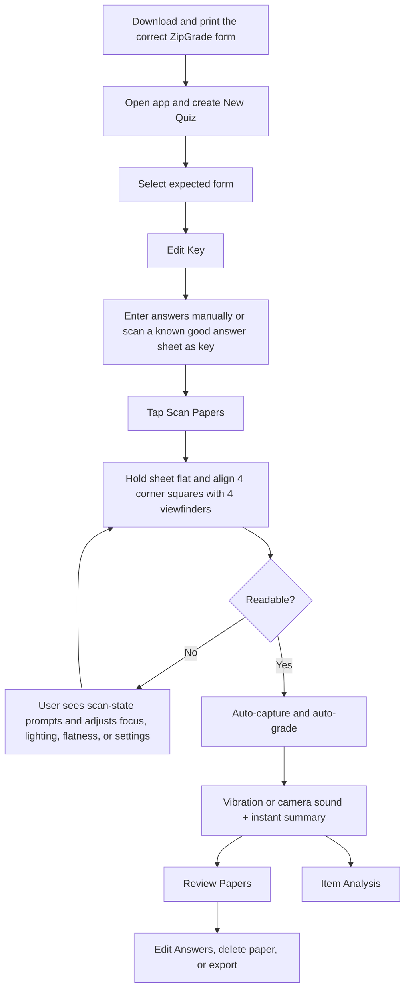
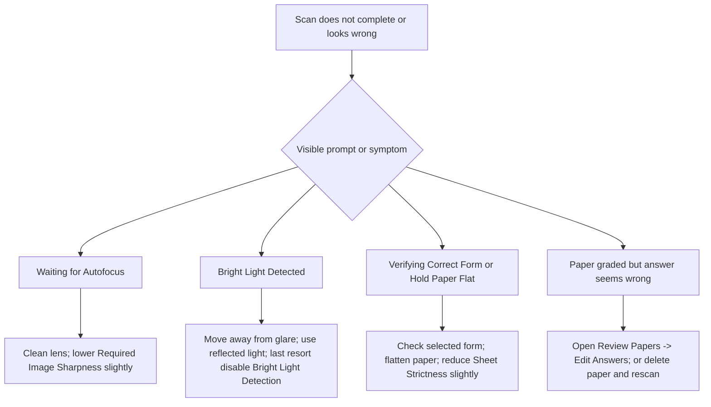

# ZipGrade Cellphone Scanning in Practice

## Executive Summary

ZipGrade’s phone-based grading workflow is built around a fixed-form optical mark recognition process: the teacher selects the expected answer-sheet template, defines the answer key, opens the in-app scanner, and then holds each paper flat so the sheet’s four corner squares align with the four on-screen viewfinders. When the app judges the image readable, it auto-focuses, auto-captures, vibrates or plays a camera sound, grades the sheet immediately, and offers a summary with paths into **Review Papers** and **Item Analysis**. Official materials emphasize that this is meant to work without pressing a shutter button for each page and that scanning can occur offline, with optional syncing later. citeturn24view0turn3search5turn6view0

In practical terms, ZipGrade does **not** ask the teacher to photograph arbitrary worksheets. It expects one of its supported forms: standard 20-, 50-, or 100-question sheets, or a published custom form created in ZipGrade’s web-based custom form wizard. For best scan reliability, ZipGrade instructs users to print on standard white copier paper, keep sheets flat, avoid folds and curling, fully fill bubbles, erase mistakes completely, clean the phone lens, and avoid direct task lighting that creates glare or shadows. Official sources specify minimum app OS support, but they do **not** publish minimum camera megapixels, RAM, or a numeric target distance from paper; those are effectively left to the app’s viewfinder/alignment and autofocus checks. citeturn25view0turn27view0turn12view0turn30view0

What the user can actually see of the recognition pipeline is revealing. ZipGrade surfaces scan-state messages such as **Waiting for Autofocus**, **Bright Light Detected**, **Verifying Correct Form**, and **Hold Paper Flat**. That strongly suggests a conventional camera-OMR pipeline of focus/sharpness checking, form registration via printed anchor markers, and then darkness detection in predefined answer regions. ZipGrade does not publish its exact algorithm, but this interpretation is consistent with OMR literature describing corner-anchor detection, skew and perspective correction, thresholding or pixel-density measurement, and sensitivity to glare, faint fills, and poor erasures. citeturn12view0turn18view2turn16search1turn16search4

ZipGrade’s main safety valve is human review rather than hidden algorithmic magic. If a sheet is ambiguous, the teacher can open **Review Papers**, inspect the stored image, and choose **Edit Answers** to toggle which circles should count as dark; the paper is then regraded. Teachers can also delete a graded paper and scan it again, edit a mis-bubbled key version, define alternate answers, and configure partial credit on the key side. In other words, ZipGrade’s practical reliability comes from a combination of constrained form design, live scan checks, and fast post-scan correction tools. citeturn24view0turn23search0turn2search13turn23search2turn32view0turn33view0

## End-to-End Workflow

The official quick-start and support materials describe a short, repeatable loop: print the correct form, create a quiz, define the key, scan papers, review them, and export results. The table below condenses the workflow that a teacher actually follows on a phone or tablet. citeturn24view0turn3search5turn25view0

### Workflow table

| Phase | What the teacher does | What the app/UI shows | Practical notes |
|---|---|---|---|
| Setup forms | Download a standard 20-, 50-, or 100-question sheet, or publish a custom form from the website. Print on standard white copier paper. | Forms page with downloadable PDF/PNG options and custom-form wizard. | Standard forms support up to 20, 50, or 100 questions; the 50-question form supports 5-digit IDs and the 100-question form supports 9-digit IDs. citeturn25view0turn30view0 |
| Create quiz | On the mobile app’s **Quizzes** screen, start a new quiz and choose the physical form that will be scanned. | **New Quiz** or **+ New Quiz**, then quiz creation fields. | Choosing the correct form matters because scan detection is template-based. ZipGrade explicitly tells users to make sure the selected form matches the printed sheet. citeturn3search5turn10search7turn12view0 |
| Define key | Tap **Edit Key** and either enter answers manually or scan a known good answer sheet as the key. | **Edit Key**, per-question rows, question-detail **i** button, add-answer controls. | Only questions with answers defined in the key are graded, so a larger form can still be used for a shorter quiz. citeturn3search5turn10search7turn32view0 |
| Optional roster setup | Import students from CSV on the website or add them manually in the app. | Website student import flow; app **Students** tab. | ZipGrade can grade without student records, but official docs recommend student records and IDs to improve exports and reporting. citeturn28view0turn24view0 |
| Start camera grading | Tap **Scan Papers**. Hold the paper flat and align the sheet’s four corner squares in the four viewfinders. | Scanner view with corner viewfinders; no shutter press required. | ZipGrade says it will auto-focus and identify when the paper is readable; scanning is designed to be hands-free once alignment is right. citeturn24view0turn3search5turn10search7 |
| Capture and grade | Keep the sheet steady until the app accepts it. | Vibration or camera sound; instant summary with links for more detail. | Official materials describe immediate grading in scan mode and then access to **Review Papers** or **Item Analysis**. citeturn24view0turn3search5 |
| Review | Open **Review Papers** to inspect stored images and scores. | Paper images, markup colors, paper-level menu. | Teachers can manually correct ambiguous reads in **Edit Answers** and the paper is regraded on return to the list. citeturn24view0turn23search0turn21search1 |
| Analyze and export | Use **Item Analysis** and then export from the app or website. | **Item Analysis**; export button; website **PDF** and **CSV** dropdown menus. | Exports include CSV and PDF; iOS and Android share-sheet destinations vary by installed apps. citeturn24view0turn22search1turn6view0 |

## How Camera-Based Scanning Works

ZipGrade’s official materials describe the phone as an “optical scanner” but stop short of publishing detailed code-level internals. What they do disclose makes the practical pipeline fairly clear. First, the app expects a specific answer-sheet form. Second, the user aligns the printed corner squares with four on-screen viewfinders. Third, the app waits for a sufficiently readable image before it auto-captures. That sequence indicates that recognition is form-based, not free-form; the app is using the sheet layout as a template and deciding when the picture is sharp and aligned enough to trust. citeturn6view0turn24view0turn12view0

The most informative evidence comes from ZipGrade’s own troubleshooting prompts. **Waiting for Autofocus** implies that image sharpness is checked before grading. **Verifying Correct Form** and **Hold Paper Flat** imply that the app is testing whether expected dark reference features are present in expected geometric positions. ZipGrade explicitly says these messages appear when it “is unable to find all the dark squares where they expect them,” and it offers a **Sheet Strictness** control for cases where form verification is too strict. That is very close to the standard OMR literature model: detect anchor markers, correct skew or perspective, map expected answer regions, and only then classify marks. citeturn12view0turn24view0turn18view2

Academic and technical OMR sources support that reading of the system. Reviews of camera-based OMR describe four-corner markers or other fiducials for registration, skew and perspective correction before mark reading, and then determination of whether a response region is dark enough to count as filled. The same literature repeatedly flags the usual pain points: partially filled bubbles, badly erased bubbles, folds, tears, printer variation, and glare. ZipGrade’s visible prompts and user instructions line up with those failure modes almost exactly, even though the company does not disclose its exact thresholds or image-processing stack. citeturn18view2turn16search1turn16search4turn34view0

### Required materials and capture conditions

| Requirement | What is specified | What remains unspecified |
|---|---|---|
| Answer sheets | Official standard forms are available in 20-, 50-, and 100-question versions, with custom forms available through the website wizard. citeturn25view0 | The reviewed sources do not publish a supported list of third-party bubble-sheet layouts; the workflow assumes ZipGrade’s own forms or custom forms created in ZipGrade. citeturn25view0turn12view0 |
| Paper | ZipGrade recommends standard white copier paper for best scanning results. citeturn25view0 | No official paper-weight or brightness specification was found in the reviewed sources. citeturn25view0 |
| Marking instrument | ZipGrade says it can read blue or black pen and pencil; answer-sheet instructions say “Use pencil or dark pen,” “Fill circle fully,” and “Erase mistakes completely.” citeturn23search0turn27view0 | No official darkness threshold, pen-tip size, or pencil hardness is published. citeturn23search0turn27view0 |
| Lighting | Official guidance is to use reflected light and avoid direct desk/task lights that create glare and shadows. citeturn12view0 | No lux target or formal lighting spec is published. citeturn12view0 |
| Device | Minimum supported mobile OS is iOS 10 or Android 6; the app relies on autofocus/sharpness checks during scan mode. citeturn30view0turn12view0 | No official minimum megapixel count, RAM, or processor requirement was found in the reviewed sources. citeturn30view0turn12view0 |
| Positioning | Hold the paper flat and align the four corner squares with the four viewfinders. citeturn24view0turn3search5 | No official numeric distance, tilt angle, or zoom setting is published; in practice the viewfinder alignment is the operative guidance. citeturn24view0turn3search5 |
| Multi-page handling | Official camera-scanning instructions describe scanning answer sheets one at a time. For PDF upload, ZipGrade requires one answer sheet per page. citeturn24view0turn23search1 | No official “multi-page per student in one camera capture” workflow was found in the reviewed mobile-scanning sources. That appears to be page-level, not booklet-level, processing. citeturn24view0turn23search1 |

### Bubble recognition and what users can observe

For actual answer recognition, ZipGrade tells students to fill bubbles fully and keep stray marks to a minimum. It also says the app handles erasures and white-out well, but it does **not** publish how dark a bubble must be before it counts as filled. In practice, that means the user sees the result of mark classification, not the threshold itself. If a teacher suspects a wrong call, the app’s intended remedy is visual review and override, not low-level tuning of per-bubble detection logic. citeturn24view0turn23search0turn27view0

It is important to separate two different ideas that are easy to confuse. A **partially filled bubble** is a scanning-recognition issue: did the app decide the mark was dark enough? A **partial-credit answer rule** is a scoring issue: if the student gave response **AB**, how many points should that exact response earn? ZipGrade is explicit that it does **not** infer nuanced “partially correct” multi-select scoring on its own; teachers must define alternate answers and point values, or use the website’s **Partial Credit Wizard**, to tell the system how to score each permitted response pattern. citeturn32view0turn33view0

### User-visible feedback on scanned papers

When teachers open a graded paper, ZipGrade overlays meaning onto the circles. Official support defines **green** as part of the correct answer and darkened by the student, **red** as darkened but not part of the correct answer, **orange** as part of the correct answer but not darkened, and **blue** as darkened in a question that is not part of the keyed quiz. At the question level, a **red X** means incorrect, a **green C** means correct, and a **purple P** means partial credit. That visual markup is the main way users audit whether the scanner interpreted marks as intended. citeturn21search1

## Failure Modes and Troubleshooting

ZipGrade’s official support is unusually concrete about scan failures, and those instructions are the best guide to what goes wrong in real classrooms. The recurring problems are wrong form selection, dirty lenses, non-flat paper, glare, and overly strict detection settings relative to the printed sheet. citeturn12view0turn24view0

### Failure-mode table

| Failure mode | What the user sees | Likely cause | Official or evidence-based fix |
|---|---|---|---|
| Wrong sheet template | Paper will not scan; form-verification issues | The quiz was created with a different form than the physical sheet, especially when custom forms are involved. | Open the quiz, use the pencil icon to reach **Edit Quiz**, and select the correct answer-sheet form. For custom forms, confirm the printed form name/number matches the selected form. citeturn12view0turn21search7 |
| Focus failure | **Waiting for Autofocus** | Lens smudge, low sharpness, motion, or difficult camera focus. | Clean the lens and, if needed, lower **Required Image Sharpness** slightly in scanner settings. citeturn12view0 |
| Glare/shadow failure | **Bright Light Detected** | Direct light creates glare on circles or a brighter white inside a circle than elsewhere. | Move to reflected light, change position, avoid task lamps pointed at the page; as a last resort disable **Bright Light Detection**. citeturn12view0 |
| Geometry/form-detection failure | **Verifying Correct Form** or **Hold Paper Flat** | Curled paper, poor reproduction of black squares, altered legacy forms, or sheet not flat enough for marker detection. | Flatten the sheet, avoid stacks/curling, ensure the expected dark squares are present, and lower **Sheet Strictness** slightly if needed. citeturn12view0 |
| Ambiguous handwritten/erased mark | Paper scans, but one answer appears wrong or duplicated | Stray marks, incomplete erasure, cross-outs, or lightly filled bubbles. | In **Review Papers**, open the paper, choose **Edit Answers**, and toggle the blue **X** markers to define which circles should count as dark; the paper then regrades. citeturn23search0turn21search1 |
| Pen corrections | Crossed-out pen answer is read badly | Pen leaves darker residual strokes than a clean erase. | ZipGrade recommends correction tape as best, liquid paper as workable, and manual override if neither is available. citeturn23search0 |
| Mis-bubbled key version | Paper grades against the wrong version | Student encoded the wrong key version. | Edit the paper on the **Edit Answers** page; ZipGrade also automatically uses the encoded key version when it has been defined. citeturn23search2 |
| Need full rescan | Teacher no longer trusts a stored grading result | Bad capture or wrong paper retained in quiz. | Delete the graded paper from the paper menu and scan again. On website PDF grading, failed pages can be downloaded, reviewed, and reuploaded if needed. citeturn2search13turn23search1 |

A practical takeaway from both ZipGrade’s support notes and broader OMR literature is that most failures are not mysterious AI problems. They are usually one of four plain-image issues: the app cannot find the **expected form**, cannot get a **sharp enough image**, is being fooled by **glare**, or is being asked to interpret an **ambiguous mark**. That is exactly why ZipGrade exposes focus, brightness, and form-strictness settings and also stores the sheet image for later human correction. citeturn12view0turn18view2turn16search4

## Results, Export, and Sharing

Once the scan succeeds, ZipGrade stores both the **score** and the **image** of the paper on the device; if syncing is enabled, that data can also be viewed on ZipGrade’s website. The review surface is not just a score list. Official materials explicitly say teachers can view actual scanned paper images, drill into item analysis, and export captured data for reporting or load into other systems. citeturn7view0turn24view0turn6view0

On the analytics side, **Item Analysis** provides a question-by-question view of class performance, including drill-through to alternative answers and the students who gave those answers. ZipGrade also publishes a **Discriminant Factor**, defined as the Pearson correlation between answering a question correctly and total test performance. In practical use, that means the scan is only the beginning: the stronger value proposition is that the paper images and decoded responses become structured assessment data immediately after capture. citeturn24view0turn31view0turn6view0

### Export and sharing table

| Format or channel | Where it is initiated | What it is for | Notes |
|---|---|---|---|
| CSV results | Mobile app export button or website **CSV** dropdown | Spreadsheet analysis, gradebook import, broader reporting | On iPhone/iPad, ZipGrade recommends **CSV – Full Data Format** when maximum detail is needed. On the website, CSV exports are available from multiple report options. citeturn22search1turn6view0 |
| PDF reports | Mobile app export button or website **PDF** dropdown | Printing, hand-back, posting, report-style sharing | The Google Play listing says teachers can export PDF reports “to print and hand back or post.” Website exports offer multiple PDF reports as dropdown choices. citeturn24view0turn22search1 |
| Share-sheet destinations | Mobile app export flow | Delivery to other apps/services | Official support mentions destinations such as Google Drive, Dropbox, or email, varying by installed apps and platform. citeturn22search1 |
| Website review and reporting | ZipGrade.com after sync | Cross-device review, additional analytics, filtering by class | ZipGrade says data may sync to the website and other devices; the website provides additional reporting and analytics. Website exports reflect only data that has synced. citeturn6view0turn22search1 |
| Student-facing result posting | Student Portal / online quiz workflows | Returning results online for scanned or online quizzes | ZipGrade says teachers can post results for quizzes taken online or scanned in person, and the student portal requires teacher-issued credentials. citeturn6view0turn7view0turn1search4 |
| Direct external-system sharing | At teacher direction through export/integration flows | Gradebook or LMS transfer | ZipGrade’s privacy policy states that teachers may export or send data to gradebook software or an LMS; the reviewed sources do not enumerate every supported external system. citeturn8view0 |

A few caveats matter. The reviewed sources clearly establish **PDF** and **CSV** as the core result formats, but they do **not** publish a full public schema for every result-export variant. What is documented is enough for practice: roster-linked exports are richer, the **External ID** field can be included in exports, and app/website exports can be filtered by class to avoid mixing sections. citeturn28view0turn13search16turn22search1

## Privacy and Security

ZipGrade’s privacy model is more teacher-controlled than many classroom apps, but it is not purely on-device by default. The company’s privacy policy states that the mobile app captures the image of each graded paper and stores the score and image locally first. In the default configuration, graded-paper data, student information, and paper images are then synced to ZipGrade’s secure servers so the teacher can use the website and multiple devices. Teachers who do **not** want quiz data, paper images, or results to reside on ZipGrade servers can disable syncing from **My Account** on the website. citeturn7view0turn29view0

The tradeoff is blunt. If syncing is disabled, the teacher loses cloud backup, website access to reports, and multi-device sync, and official support warns that ZipGrade data is not backed up to iCloud or other iOS backups in a way that replaces ZipGrade Cloud. In plain English: **maximum privacy means maximum local-data risk** if the device is lost or corrupted. citeturn29view0turn8view0

On the security side, ZipGrade states that user-managed data is encrypted in transit and at rest, specifying SSL/TLS in transit and AES-256 at rest, and says passwords are salted and one-way hashed rather than stored in plain text. The privacy policy also says ZipGrade does not sell user data or use it for advertising, and Google Play’s data-safety disclosure says the app shares no data with third parties, encrypts data in transit, and allows deletion requests. Account deletion on ZipGrade removes associated account and user-managed data and purges it from backups within 60 days, according to the privacy policy. citeturn8view0turn7view0turn24view0

For classrooms, the practical privacy questions are straightforward: whether to sync at all, whether to store student names and IDs instead of anonymous sheets, and whether to enable the Student Portal. ZipGrade says the portal requires teacher-issued credentials, and student-submitted data there is limited to information used for grading and identifying the submission to the teacher. That is a relatively narrow use case, but the moment syncing or portal use is enabled, paper images and student-linked assessment results are no longer only on the teacher’s device. citeturn7view0turn1search4

## Bottom Line

In practice, ZipGrade’s cellphone scanning works because it keeps the problem tightly constrained: it uses known sheet templates, printed corner markers, autofocus/readability checks, and immediate human review tools. For the teacher, the lived workflow is simple—**pick the right form, key the quiz, align the four corners, wait for auto-capture, then review and export**—but the simplicity depends on disciplined paper handling and lighting. citeturn24view0turn3search5turn12view0

The strongest evidence suggests that ZipGrade is not doing anything exotic by camera-OMR standards. It appears to follow the classic pattern of form detection, alignment correction, and mark-density interpretation, with user-facing prompts exposing exactly where that pipeline can fail. Its real advantage is operational: fast capture, one-tap review, stored paper images, manual override, and immediate analytics. Its main limitations are equally clear: rigid dependence on expected forms, ambiguity around faint or messy marks, and a privacy tradeoff between cloud convenience and keeping records only on-device. citeturn12view0turn18view2turn32view0turn8view0